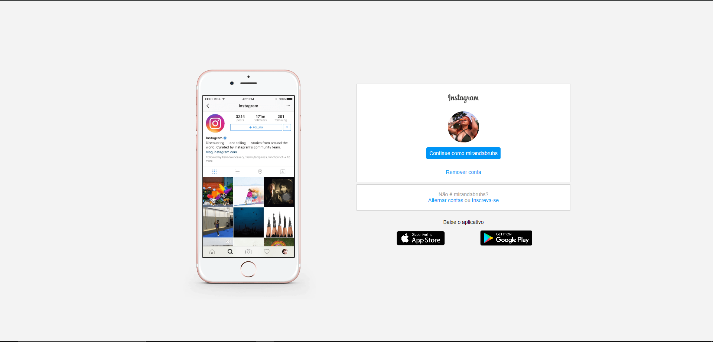

# Projeto Pagina de login Instagram

## 🖥️ https://brbmiranda.github.io/spiderman-multiverses/

Reconstrução de página responsiva de login do Instagram, feito com uso de CSS com Flexbox. 

##

## 🚀 Tecnologias

- HTML
- CSS
- Git e Github
